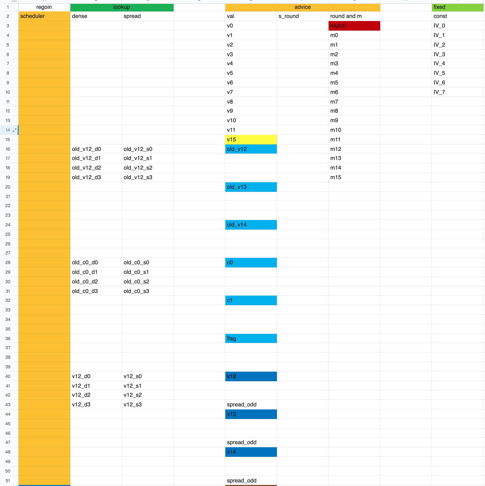
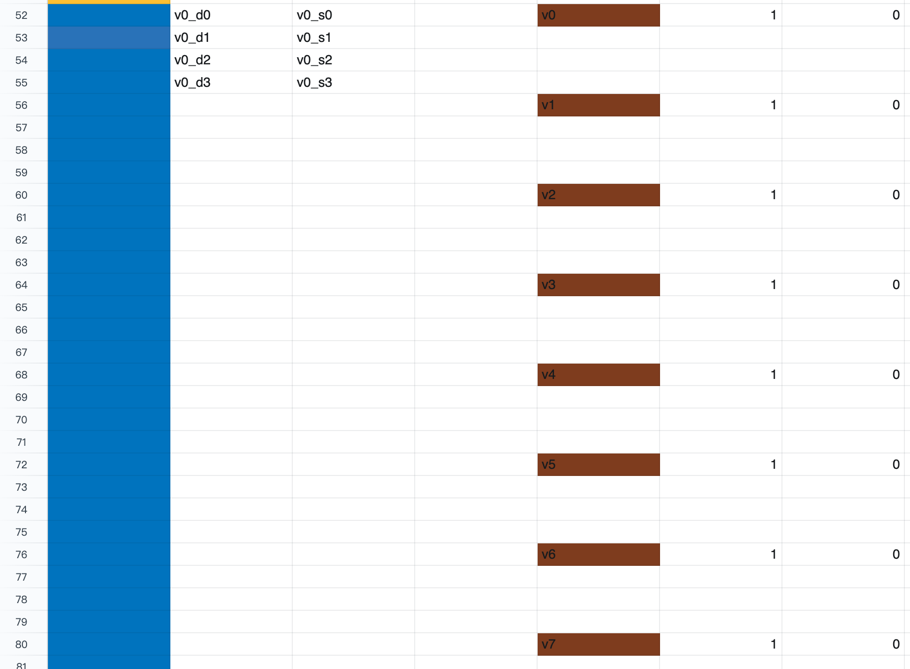
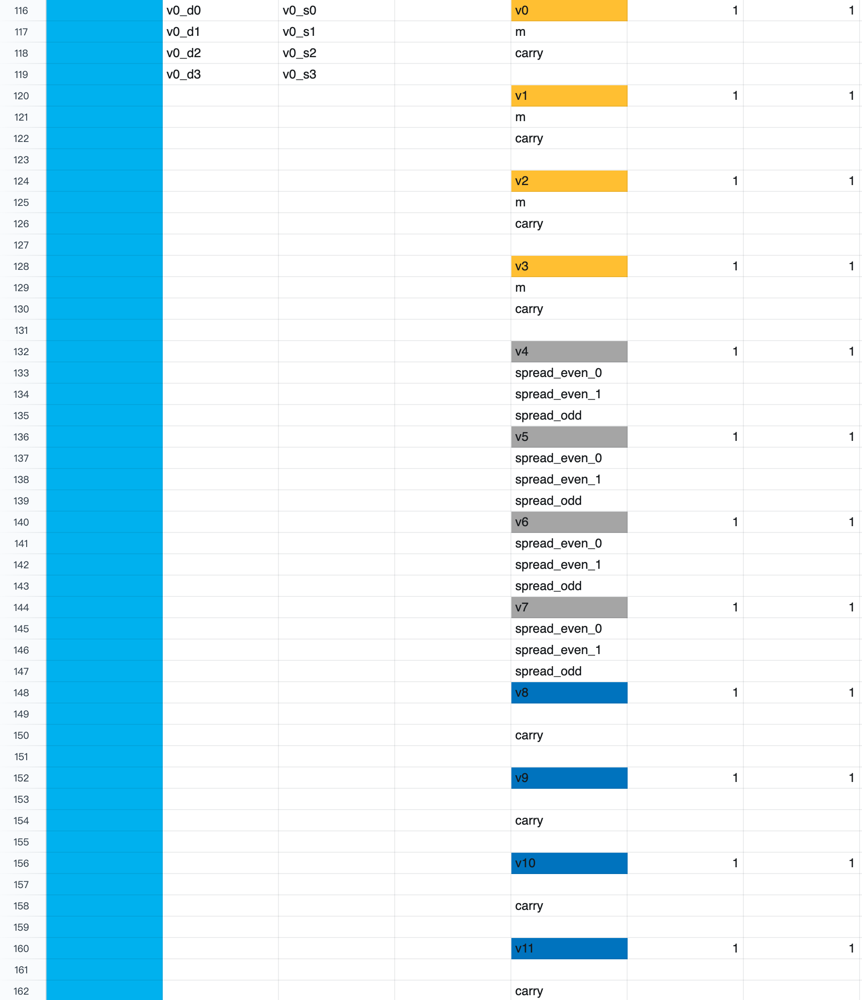
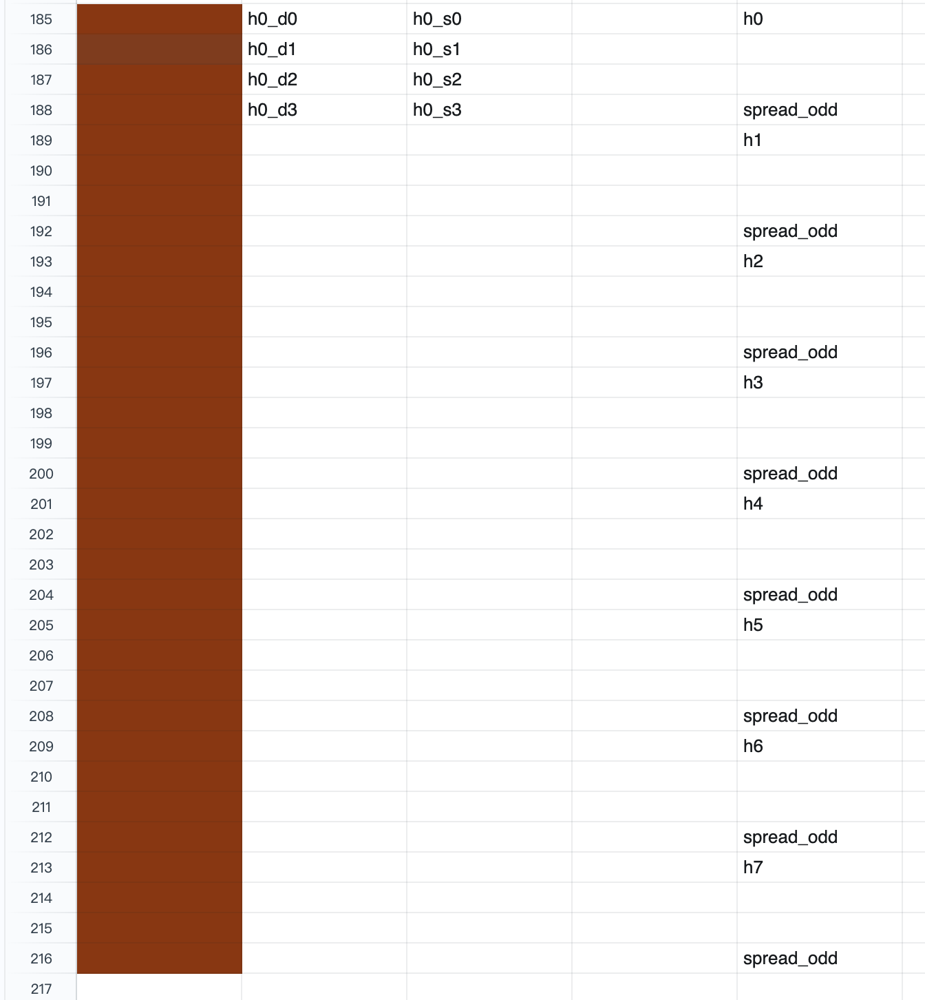
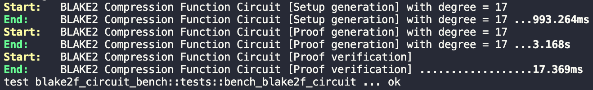

# Blake2F circuit in halo-2

We use the implemention in go-ethereum for reference:https://github.com/ethereum/go-ethereum/blob/4ab4e4f3aaa00a8f1c62899f17f582e046bfa6a1/crypto/blake2b/blake2b_generic.go#L47-L181


## Introduce

We split the blake2f function into three parts.

First part: `Scheduler`

```go
	v0, v1, v2, v3, v4, v5, v6, v7 := h[0], h[1], h[2], h[3], h[4], h[5], h[6], h[7]
	v8, v9, v10, v11, v12, v13, v14, v15 := iv[0], iv[1], iv[2], iv[3], iv[4], iv[5], iv[6], iv[7]
	v12 ^= c0
	v13 ^= c1
	v14 ^= flag
```

Second part: `MainRounds`. For each round in MainRounds, we can split it into 4 subrounds. v0-v15 were fully updated in each subround.

```go
	for i := 0; i < int(rounds); i++ {
		s := &(precomputed[i%10])

		v0 += m[s[0]]
		v0 += v4
		v12 ^= v0
		v12 = bits.RotateLeft64(v12, -32)
		v8 += v12
		v4 ^= v8
		v4 = bits.RotateLeft64(v4, -24)
		v1 += m[s[1]]
		v1 += v5
		v13 ^= v1
		v13 = bits.RotateLeft64(v13, -32)
		v9 += v13
		v5 ^= v9
		v5 = bits.RotateLeft64(v5, -24)
		v2 += m[s[2]]
		v2 += v6
		v14 ^= v2
		v14 = bits.RotateLeft64(v14, -32)
		v10 += v14
		v6 ^= v10
		v6 = bits.RotateLeft64(v6, -24)
		v3 += m[s[3]]
		v3 += v7
		v15 ^= v3
		v15 = bits.RotateLeft64(v15, -32)
		v11 += v15
		v7 ^= v11
		v7 = bits.RotateLeft64(v7, -24)
    ...
	}
```

Third Part: `Final h_xor`

```go
	h[0] ^= v0 ^ v8
	h[1] ^= v1 ^ v9
	h[2] ^= v2 ^ v10
	h[3] ^= v3 ^ v11
	h[4] ^= v4 ^ v12
	h[5] ^= v5 ^ v13
	h[6] ^= v6 ^ v14
	h[7] ^= v7 ^ v15
```


Let's focus on the MainRounds:

There are two types of operation in each round:

1. offset add:

We notice that the addition in the main rounds was always a assign addition.

For` v_i += v_j` The word `offset` means that the position difference between `i` and `j`.

For example:

```
v10 += v14   // for v10, offset here is 4
v11 += v15   // for v11, offset here is also 4
```

There is another type of offset add in blake2f. We call it `offset add with m`(only for v0, v1, v2, v3)

For example:

```
    v0 += m[s[0]]
    v0 += v4    // note that v4 was took from last subround, so the offset here is (0-16+4) = -12

    v1 += m[s[1]]
    v1 += v5    // offset here is also (1 - 16 + 5) = -12
```


All the offset add in the main rounds can be categorized into

- offset add without m,  offsets are: 1, 4, 5
- offset with m: offsets are: -15, -12, -11


2. xor and rotate.

We notice that there always be a xor before rotate a variable.

```
v12 ^= v0
v12 = bits.RotateLeft64(v12, -32)

v5 ^= v9
v5 = bits.RotateLeft64(v5, -24)
```
So, for simplicity, we constraints xor and rotate in one step.
There are many xor_and_rotate gates in our implemention.


## Gates

### Spread Table

We use a 16-bit spread table for xor operation(explain blow).

`spread` means *pads a 0 bit in front of each bit of the original value*, i.e.

`spread(0b11) = 0b0101`,  `spread(0b101) = 0b010001`

Our table will be:

| dense(16bit)     | spread(32bit)                    |
| ---------------- | -------------------------------- |
| 0000000000000000 | 00000000000000000000000000000000 |
| 0000000000000001 | 00000000000000000000000000000001 |
| 0000000000000010 | 00000000000000000000000000000100 |
| 0000000000000011 | 00000000000000000000000000000101 |
| .....            |                                  |
| 1111111111111111 | 01010101010101010101010101010101 |

We use this table to help us to checking xor operation. (Idea borrowed from zcash/halo2/sha256 gadgets)

### Decompose Gate

For an uint64 `A`, and 4 16-bit unsigned integer `a0`, `a1`, `a2`, `a3`.

We define a  `A` = `a0` + 2^16 * `a1` + 2^32 * `a2` + 2^48 * `a3 `  as a decompose.

We lookup a0-a3 in the dense column of the spread table.So, After decompose, we can also get the spread form of a0-a3


### Xor gate

As mentioned above, after decompse a uint64, we get the spread form of it's 16-bit parts.

For a uint64 value `A`, we define

```
Spread(A) = spread(a0) + 2^32 * spread(a1) + 2^64 * spread(a2) + 2^96 * spread(a3)
```

We can find that if `A = B ^ C` , then A must be the even bits of spread(B) + spread(C).

so, for xor gate, we can enforce that:

```
spread(A) + 2 * spread(OddBits(spread(B) + spread(C)) = spread(B) + spread(C)
```

### Triple Xor

Like xor gate, we define `A = B ^ C ^ D` as a `triple xor` gate by enfore

```
spread(A) + 2 * spread(OddBits(spread(B) + spread(C) + spread(D))) = spread(B) + spread(C) + spread(D)
```


### Xor and rotate

xor_and_rotate gate is a little more complicated than xor gate.

For`(A ^= B) >> n` , we split spread(A) into 2 parts: spread_even_0, spread_even_1 by the rotate length n.

spread_even_0 is the first (128 - 2n) bits of spread(EvenBits(spread(old_A) + spread(B)) and spread_even_1 is the remain part.

spread_odd is spread(OddBits(spread(old_A) + spread(B))

Here are our constraints:

```
spread_even_0 * 2^2n + spread_even_1 + 2 * spread_odd = spread(old_A) + spread(B)
spread(A) = 2^(128 - 2n) * spread_even_1  + spread_even_0
```


### Offset add

Note that all addition in blake2f are overflowing assign-add between unsigned 64-bit integers.

so, we define `v_i = old_v_i + v_j` as offset add gate by enforce:

```
v_i + 2^64 * carry = old_v_i + v_j
```

### Round

One thing special about blake2f is that its execution round was determined by a parameter: `round`.

we can only set a MAX_ROUND in the circuit.If current round <= round, we updated state of v0-v15 by calculation, otherwise, we just copy state from previous subround until to MAX_ROUND.In order to represent the logic of round in blake2f, we design two columns: `s_round_column` and  `round column` .

Here are our constraints:

```
1. value in s_round column must be a boolean:
	(s_round) * (1 - s_round) = 0

2. if s_round is 1, the the previous s_round must be 1:
	s_round * (1 - prev_s_round) = 0

3. if s_round is 1, then cur_round - prev_round must be 1:
	s_round * (round - prev_round -1) = 0

4. if s_round is zero, then cur_round must be equal to prev_round:
	(1 - s_round) * (cur_round - prev_round) = 0

```


## Layout of circuit

We use one fixed column to store `IV`

We use two columns for lookup: `dense column` and  `spread column`

two advice columns to store `s_round` and `round`

another one advice column to store `val` we used.


The figures below would be more instructive!

## Assignments

`Scheduler`:

for scheduler:

```
	v0, v1, v2, v3, v4, v5, v6, v7 := h[0], h[1], h[2], h[3], h[4], h[5], h[6], h[7]
	v8, v9, v10, v11, v12, v13, v14, v15 := iv[0], iv[1], iv[2], iv[3], iv[4], iv[5], iv[6], iv[7]
	v12 ^= c0
	v13 ^= c1
	v14 ^= flag
```

- assign IV into fixed column
- assign v0-v7 into `val` column **without** decompse
- copy v8-v11, v15 from fixed column **without** decompse
- copy old_v12, old_v13, old_v14 from fixed column **with** decompse (because we need to ensure v12,v13,v14 were generated correctly by a xor operation on the old values, so we need the spread form of their 16-bit parts).
- assign c0, c1, flag into `val` column **with** decompse
- ensure v12, v13, v14 was generated correctly by enable decompose gates and xor gates




### MainRounds

Round 0:

- copy v0-v15 into the begining of MainRounds **with** decompose.

- assign `s_round` to 1 and `round` to 0 in the same rows as v0-v15




Round1 to MAX_ROUND:

- copy `m` to the correct cell from scheduler (we assign `m` in the `round` column in scheduler). only v0-v3 need `m` stored next to them.
- for the value updated by `offset_add` , set carry to 1 if overflow happened while updated the value, otherwise, set carry to 0
- for the value updated by `xor_and_rotate`.store the spread even bits in two parts (according to rotate) and spread_odd as a single value.
- set s_round to 1 if the round is not a padding from last round.
- set round to max(cur_round, `round`)
- enforce equal between the last assigned `round` and the `round` assigned in the Scheduler(first row in round column) to ensure



### Final h_xor

Note that eventhough we split final h_xor as a single part.But in implemention, we assign final h_xor and MainRounds in the same `Region`.

So, for final_h_xor:

```go
    h[0] ^= v0 ^ v8   // h[0] = old h[0] ^ v[0] ^ v[8]
    h[1] ^= v1 ^ v9
    h[2] ^= v2 ^ v10
    h[3] ^= v3 ^ v11
    h[4] ^= v4 ^ v12
    h[5] ^= v5 ^ v13
    h[6] ^= v6 ^ v14
    h[7] ^= v7 ^ v15
```
 Let' use `h[0]` as an exaple.

Since `old h[0]` was assigned to v0 in Scheduler. v0 in Scheduler was copied to the beginning of MainRound.So, we can find `old h[0]`at the first row of MainRound.By rotation, it's -(MAX_ROUND + 1) * ROWS_PER_ROUND.`v0` and `v8`can be easily found just a little before `h[0]`.By rotation, it's -4 * 16 and -4 * 8.

Finally:

- assign h0-h7 with decompose
- assign spread_odd from triple xor
- ensure h0-h7 were assigned correctly by enable triple_xor gates




## Summary

We implement blake2f circuit with 5 advice columns and 1 fixed column.

It takes us

- 49 rows for Scheduler
- (MAX_ROUND + 1) * 64 * 4 rows for the MainRound
- 8 * 4 rows for the final h_xor

In general, it use 3,409 rows when MAX_ROUND is 12 which is the number in our codes.


Additionally, here is a test result on a 3.2Ghz CPU:


